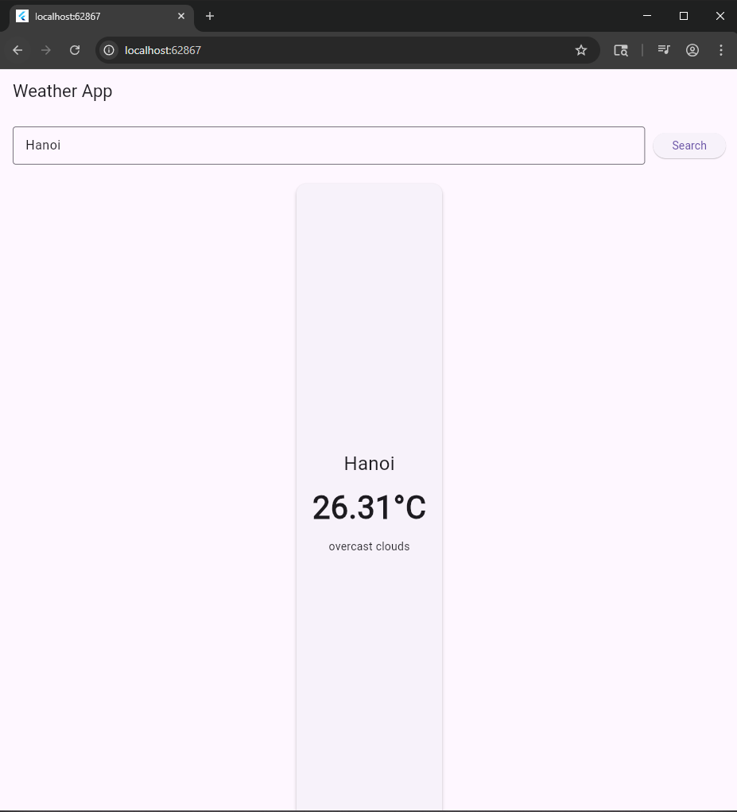
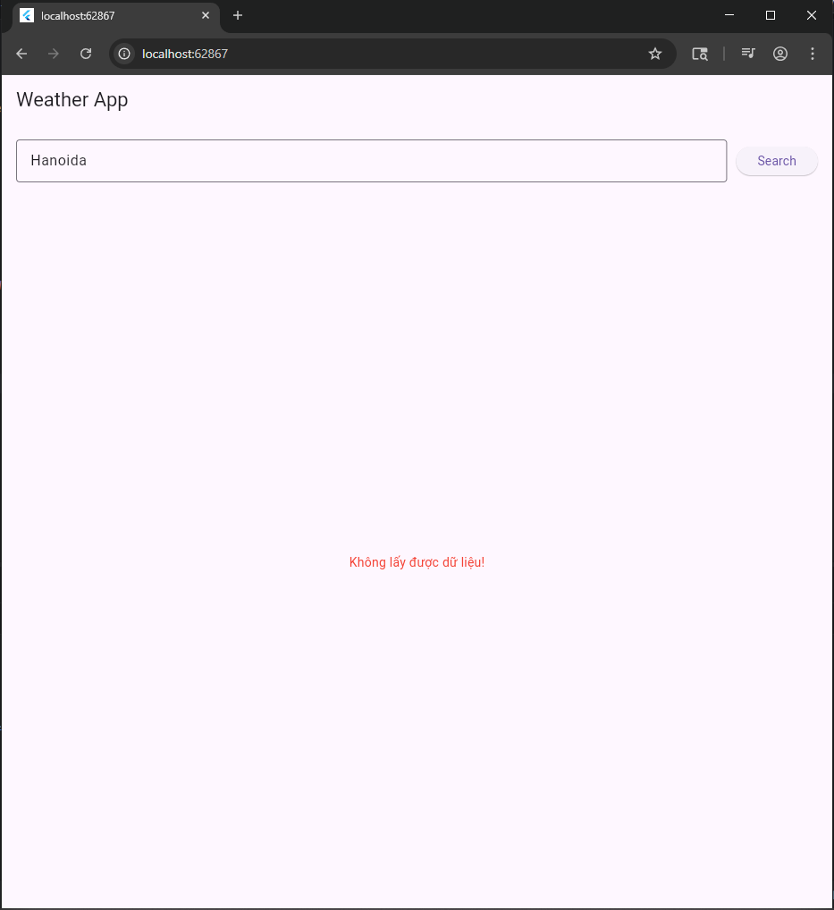

    Weather App (Flutter)
    Ứng dụng Weather App được xây dựng bằng Flutter, cho phép người dùng tìm kiếm và hiển thị thông tin thời tiết theo thời gian thực thông qua API của OpenWeatherMap.

    Tính năng chính
    Tìm kiếm thời tiết theo tên thành phố
    Hiển thị nhiệt độ hiện tại
    Hiển thị mô tả thời tiết (nắng, mưa, mây...)
    Hiển thị trạng thái loading khi đang gọi API
    Hiển thị thông báo lỗi khi không lấy được dữ liệu
    Cập nhật UI tự động với Provider

    Project được tổ chức theo mô hình tách biệt rõ ràng:
        lib/
        │── models/           # Định nghĩa dữ liệu (WeatherModel)
        │── services/         # Gọi API (WeatherService)
        │── providers/        # Quản lý state (WeatherProvider)
        │── screens/          # Giao diện chính (HomeScreen)
        │── widgets/          # Các UI component tái sử dụng
        │── config/           # Cấu hình (API key)

    Công nghệ sử dụng
    Flutter
    Provider (State Management)
    HTTP (REST API)
    OpenWeatherMap API
    Dart JSON (dart:convert)

    Luồng hoạt động
    Người dùng nhập tên thành phố
    Nhấn nút Search
    UI gọi fetchWeather() trong Provider
    Provider gọi WeatherService để lấy dữ liệu từ API
    API trả về JSON
    JSON được chuyển thành WeatherModel
    Provider cập nhật state
    UI hiển thị kết quả

LeHuynhQuocThai_2224802010031
